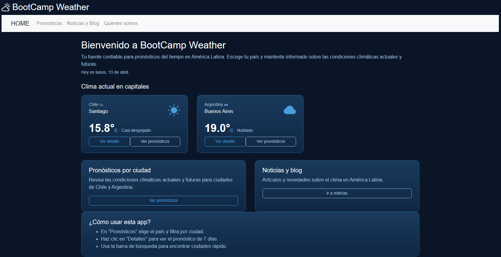

# Hola, soy Mario 👋

Desarrollador **Front-End Trainee** con base técnica sólida y más de 10 años de experiencia previa en soporte informático.  
Me enfoco en construir interfaces web y dashboards para Magic: The Gathering y aplicaciones orientadas a datos.

    
    
  

---

## Sobre mí

Vengo de una trayectoria como Técnico Informático Onsite (Quintec / Sonda, 2010–2024), trabajando en terreno y remoto para clientes como VTR, ENAP y SII.  
Me acostumbré a resolver problemas bajo presión, comunicarme claro con personas con poco conocimiento técnico y documentar soluciones para que otros puedan mantenerlas.

---

## Qué aporto a un equipo

- Comunicación clara, empatía y mentalidad de servicio.
- Capacidad de análisis y resolución práctica de problemas.
- Documentación y orden para facilitar mantención y trabajo en equipo.
- Adaptabilidad a nuevas herramientas y contextos de alta demanda.

---

## Proyectos destacados

### 🧙 Dashboard Commander — CommandCenterLandfall
Interfaz web para torneos de Commander, con ranking general, puntajes bonus, posiciones finales y enlaces a mazos en Moxfield.  
🔗 Demo: https://mackelf.github.io/CommandCenterLandfall/

### 📊 Dashboard Season 3 — MTG-Todo-Freak
Dashboard para torneos de Magic: The Gathering, con standings, filtros por fecha, rendimiento por jugador, arquetipos y resultados por torneo.  
🔗 Demo: https://mackelf.github.io/MTG-Todo-Freak/

### 🌦 weather-frontend-m2
Aplicación de clima con consumo de API y maquetación responsive en JavaScript.

---
## 📈 Mis estadísticas

## Stack actual

- HTML5, CSS3/Sass, JavaScript (ES6+)
- Vue.js 3, Bootstrap 5
- Git, GitHub, VS Code, Google Apps Script

---

## Contacto

**Disponible para oportunidades y proyectos Front-End, y para integrarme a equipos de desarrollo.**

- Correo: mario.canto2008@gmail.com
- GitHub: [@Mackelf](https://github.com/Mackelf)
- Linkedin [Mario Canto](https://linkedin.com/in/mario-canto-534754240)
